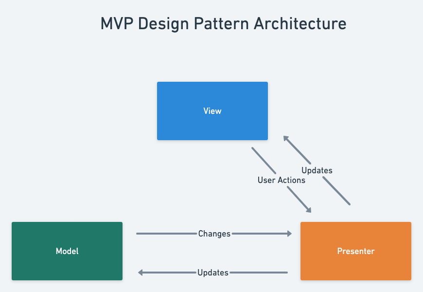

## MVP Design Pattern Architecture

 

 Model View Presenter (MVP) is a design pattern that separates the objects into three main components: Model, View, and Presenter. Now, the View Controller is considered as View, and the presenter contains all the business logic of the application.

 

- **Presenter** is the single object that handles the interaction between a view and a model.

- **Model** is a plain object that’s used by the presenter.

- **View** contains view controllers and XIB files (if any) and doesn’t do much on its own. Its responsibility is to send events to the presenter and wait for the result. After getting the result, it updates itself if needed.
  
   
 

